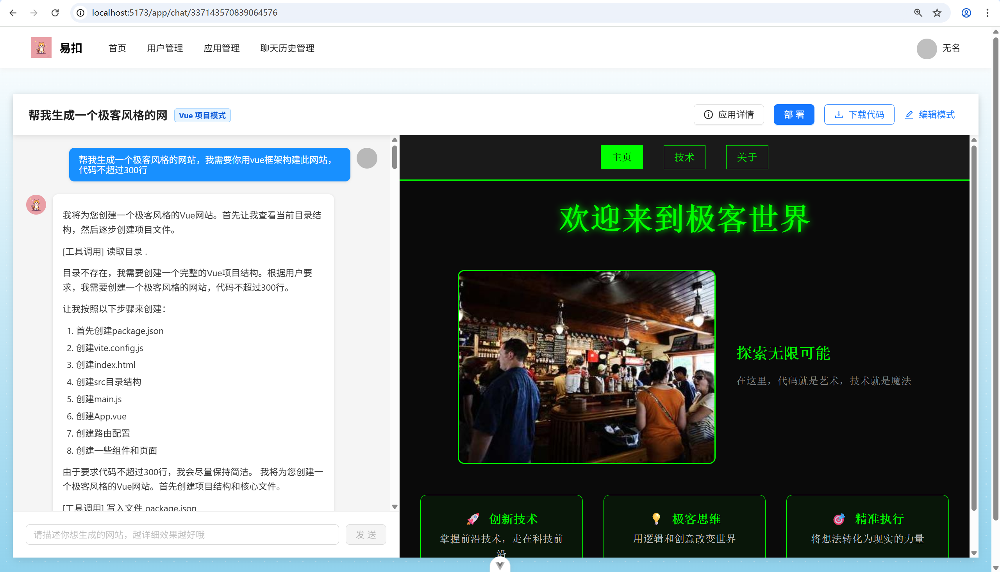
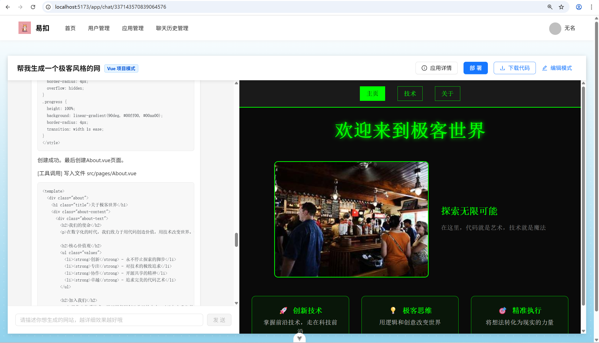
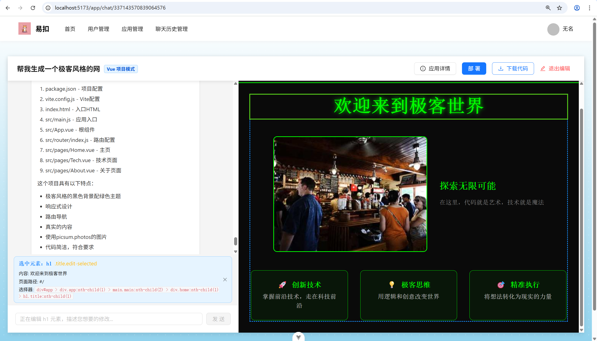
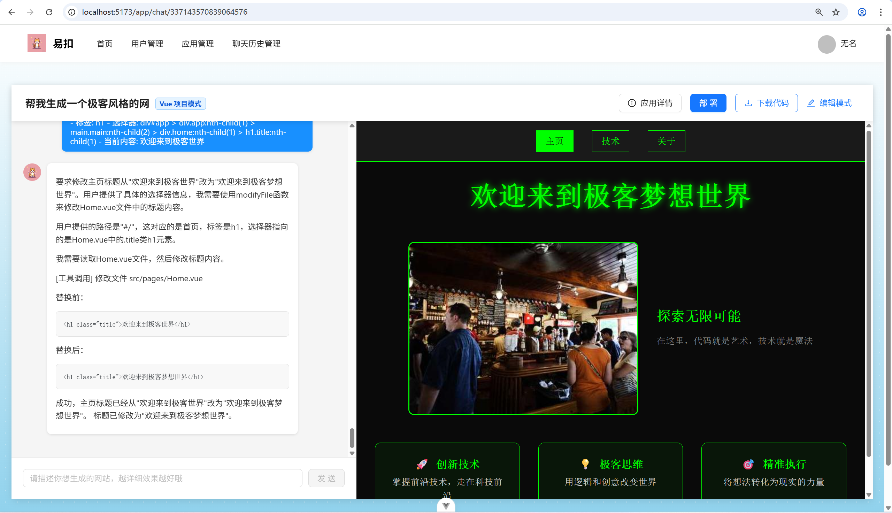
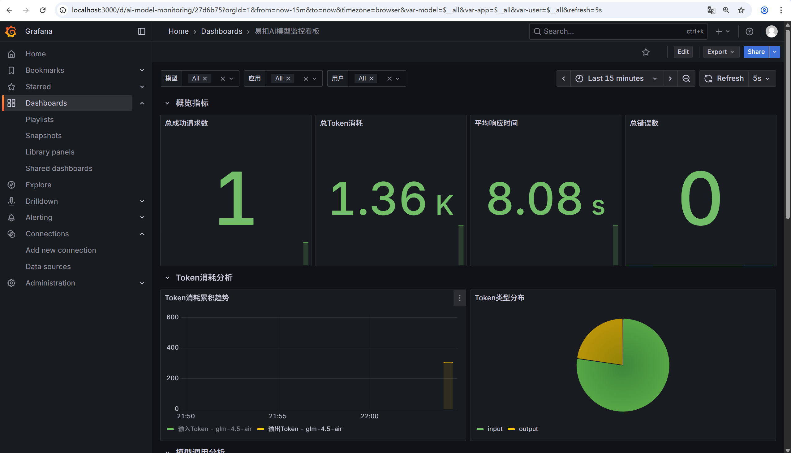
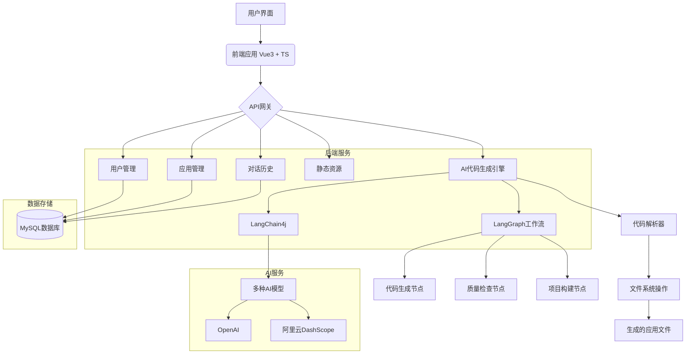

# 易扣AI - AI应用生成平台

<p align="center">
  
</p>

<p align="center">
  <a href="https://github.com/FeiWuSama/yikou-ai-feiwu/stargazers">
    
  </a>
  <a href="https://github.com/FeiWuSama/yikou-ai-feiwu/issues">
    
  </a>
</p>

易扣AI是一个基于人工智能的零代码应用生成平台，用户只需描述需求，即可自动生成完整的Web应用程序。平台支持多种应用类型，包括静态网站、多页面应用和Vue项目，并提供可视化编辑功能。

## 项目演示

<p align="center">
  
</p>

<p align="center">
  
</p>

<p align="center">
  
</p>

<p align="center">
  
</p>

<p align="center">
  
</p>

<p align="center">
  
</p>

<p align="center">
  
</p>

<p align="center">
  
</p>

## 🌟 特性

- **零代码开发**：通过自然语言描述需求，自动生成完整应用
- **多应用类型支持**：支持HTML单页应用、多文件应用和Vue项目
- **可视化编辑**：在预览页面中直接选择元素进行修改
- **实时预览**：边生成边预览，实时查看应用效果
- **一键部署**：生成的应用可一键部署到服务器
- **代码下载**：可下载生成的完整源代码进行二次开发

## 🏗️ 技术架构

### 前端技术栈
- **Vue 3** + **TypeScript**：现代化前端框架
- **Vite**：快速构建工具
- **Ant Design Vue**：UI组件库
- **Pinia**：状态管理
- **Vue Router**：路由管理

### 后端技术栈
- **Spring Boot 3.5**：Java后端框架
- **MySQL**：关系型数据库
- **Redis**：缓存和会话存储
- **LangChain4j**：Java语言的AI集成框架
- **MyBatis-Flex**：ORM框架

### AI能力
- **多种AI模型支持**：支持OpenAI、阿里云DashScope等模型
- **智能代码生成**：基于提示词工程的代码生成
- **工具调用**：支持文件读写、目录操作等工具调用
- **质量检查**：生成代码的质量检查和优化

## 🚀 快速开始

### 环境要求
- **Node.js** >= 20.19.0
- **Java** >= 21
- **MySQL** >= 8.0
- **Redis** >= 6.0
- **Maven** >= 3.8

### 后端部署

1. 创建数据库：
```sql
create database if not exists yikou_ai;
```

2. 修改配置文件 `src/main/resources/application.yml` 中的数据库和Redis连接信息

3. 构建并运行：
```bash
mvn clean install
mvn spring-boot:run
```

### 前端部署

1. 进入前端目录：
```bash
cd yikou-ai-feiwu-front
```

2. 安装依赖：
```bash
npm install
```

3. 启动开发服务器：
```bash
npm run dev
```

4. 构建生产版本：
```bash
npm run build
```

## 📁 项目结构

```
yikou-ai-feiwu/
├── src/main/java/              # 后端Java源码
│   ├── com/feiwu/yikouai/ai/   # AI相关功能
│   ├── com/feiwu/yikouai/controller/  # 控制器
│   ├── com/feiwu/yikouai/service/     # 业务逻辑
│   └── com/feiwu/yikouai/core/        # 核心功能
├── src/main/resources/         # 后端资源配置
│   ├── prompt/                 # AI提示词模板
│   └── application.yml         # 配置文件
├── yikou-ai-feiwu-front/       # 前端项目
│   ├── src/
│   │   ├── pages/              # 页面组件
│   │   ├── components/         # 公共组件
│   │   ├── api/                # API接口
│   │   └── utils/              # 工具函数
│   └── package.json            # 前端依赖
└── sql/                        # 数据库脚本
```

### 项目结构图



## 🧠 核心功能

### 应用生成流程
1. 用户输入应用需求描述
2. 系统根据需求选择合适的AI模型和生成策略
3. AI生成代码并通过工具调用写入文件系统
4. 实时展示生成进度和预览效果
5. 生成完成后可进行可视化编辑和部署

### 可视化编辑
- 在预览页面中直接点击元素进行选择
- 通过自然语言描述修改需求
- AI理解需求并自动修改对应代码
- 实时预览修改效果

### 部署功能
- 一键部署生成的应用
- 支持自定义部署域名
- 自动生成部署链接

## 📦 功能模块

### 后端功能模块

#### AI代码生成模块
- **AiCodeGeneratorService**: AI代码生成服务，支持多种代码生成类型
- **AiCodeGenTypeRoutingService**: 代码生成类型路由服务，根据需求选择合适的生成策略
- **工具调用模块**: 提供文件读写、目录操作等工具支持AI生成代码
- **输出防护模块**: 包含Prompt安全检查和重试机制

#### 核心处理模块
- **AiCodeGeneratorFacade**: AI代码生成门面，统一处理代码生成流程
- **CodeParser**: 代码解析器，解析AI生成的代码内容
- **CodeFileSaver**: 代码文件保存器，将生成的代码保存到文件系统
- **StreamHandlerExecutor**: 流式处理执行器，处理AI流式响应

#### LangGraph工作流模块
- **CodeGenWorkflow**: 代码生成工作流，编排整个生成过程
- **CodeGenConcurrentWorkflow**: 并行代码生成工作流
- **各种节点实现**: 包括代码生成节点、质量检查节点、项目构建节点等
- **图像收集模块**: 支持为应用添加图片、图标、图表等视觉元素

#### 业务功能模块
- **UserController**: 用户管理控制器，处理用户注册、登录等操作
- **AppController**: 应用管理控制器，处理应用创建、查询、更新、删除
- **ChatHistoryController**: 对话历史控制器，管理用户与AI的交互记录
- **StaticResourceController**: 静态资源控制器，提供应用预览和下载功能

#### 基础支撑模块
- **认证授权模块**: 包含注解式权限检查和拦截器
- **限流模块**: 基于注解的限流实现
- **配置管理模块**: 统一管理系统各项配置
- **异常处理模块**: 全局异常处理机制
- **监控模块**: AI模型调用监控和性能指标收集

### 前端功能模块

#### 页面组件模块
- **HomePage**: 首页，展示应用列表和创建入口
- **AppChatPage**: 应用聊天页面，用户在此描述需求生成应用
- **AppEditPage**: 应用编辑页面，支持可视化编辑功能
- **UserLoginPage/UserRegisterPage**: 用户登录注册页面
- **Admin管理页面**: 用户管理和系统监控后台

#### 核心功能组件
- **AppCard**: 应用卡片组件，展示应用基本信息
- **AppDetailModal**: 应用详情模态框
- **DeploySuccessModal**: 部署成功提示模态框
- **MarkdownRenderer**: Markdown渲染组件
- **GlobalHeader/GlobalFooter**: 全局头部和底部组件

#### 业务逻辑模块
- **API接口模块**: 封装所有后端API调用
- **状态管理**: 使用Pinia管理用户登录状态
- **路由管理**: Vue Router配置，管理页面跳转
- **权限控制**: 前端访问权限控制
- **工具函数**: 包括时间处理、常量定义等辅助功能

## 🛠️ 开发指南

### 数据库设计
项目包含三个核心数据表：
- `user`：用户表，存储用户信息
- `app`：应用表，存储生成的应用信息
- `chat_history`：对话历史表，存储用户与AI的交互记录

### API接口
后端提供RESTful API接口，主要包含：
- 用户管理：注册、登录、权限验证
- 应用管理：创建、查询、更新、删除应用
- 对话管理：获取对话历史、流式对话
- 静态资源：提供生成应用的预览和下载

### AI集成
通过LangChain4j框架集成多种AI模型：
- 提示词模板管理
- 工具调用机制
- 流式响应处理
- 质量检查和优化

## 📊 监控与运维

- 集成Prometheus监控指标
- 提供健康检查接口
- AI模型调用监控
- 性能指标收集

## 🤝 贡献

欢迎提交Issue和Pull Request来改进项目。

## 📄 许可证

本项目采用MIT许可证，详情请见[LICENSE](LICENSE)文件。

## 🙏 致谢

- [Vue.js](https://vuejs.org/)
- [Spring Boot](https://spring.io/projects/spring-boot)
- [LangChain4j](https://github.com/langchain4j/langchain4j)
- [Ant Design Vue](https://www.antdv.com/)